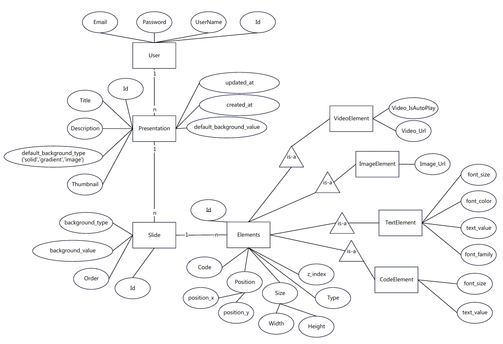
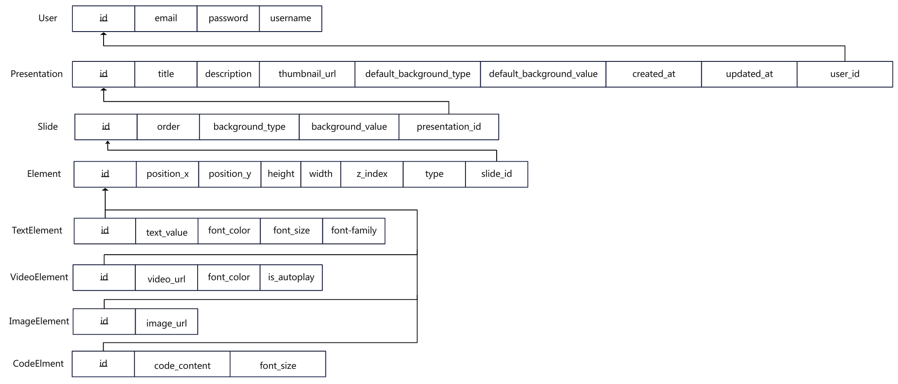
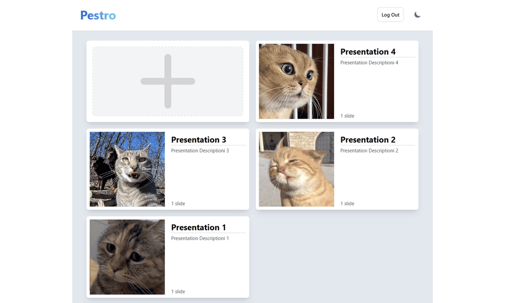

# Presento - Online Slide Editor

Presento is a full-stack **online slide editor** designed to create, edit, and share presentations efficiently. It is built using **ASP.NET Core** for the backend and **React with Vite** for the frontend. The project implements a clean architecture to ensure scalability and maintainability.

---

##  Features

- **User Authentication**: Secure login and registration system.
- **Presentation Management**: CRUD operations for presentations and slides.
- **Element Customization**: Add, edit, and arrange elements on slides (text, images, etc.).
- **Real-time Updates**: Optimized state management for seamless user experience.
- **Responsive Design**: Works across all devices and screen sizes.

---

##  Technologies Used

### **Frontend**
- **React**: Component-based UI development.
- **Vite**: Fast development and build tool.
- **Tailwind CSS**: Utility-first CSS framework for styling.
- **Zustand**: Lightweight state management library.
- **Axios**: HTTP client for API communication.

### **Backend**
- **ASP.NET Core 6**: RESTful API development.
- **Entity Framework Core**: ORM for database management.
- **SQL Server**: Relational database for storing application data.
- **FluentValidation**: Request validation for robust APIs.
- **MediatR**: CQRS (Command Query Responsibility Segregation) pattern implementation.

- **API Documentation**: Swagger

---

## 📂 Project Structure

```plaintext
Presento/
├── API/                      # Backend API
│   ├── Controllers/          # API controllers for endpoints
│   ├── DTOs/                 # Data Transfer Objects
│   ├── Middleware/           # Custom middleware
│   ├── Extensions/           # Application extensions and configurations
│   ├── Program.cs            # Application entry point
│   └── appsettings.json      # App configuration files
│
├── Application/              # Core business logic
│   ├── Core/                 # Base logic and helpers
│   ├── Elements/             # Element-related features
│   ├── Presentations/        # Presentation-related features
│   ├── Slides/               # Slide-related features
│   └── Interfaces/           # Abstractions for services
│
├── Domain/                   # Domain models
├── Persistence/              # Database setup
│   ├── Datacontext.cs        # EF Core database context
│   ├── Migrations/           # Database migrations
│   └── Seed.cs               # Data seeding
│
├── frontend/                 # React frontend
│   ├── src/                  # Source code
│   ├── components/           # Reusable components
│   ├── app/                  # App and routing logic
│   ├── assets/               # Static resources
│   ├── main.jsx              # Application entry point
│   └── helpers.js            # Utility functions
│
├── Infrastructure/           # Infrastructure settings
├── docker-compose.yml        # Docker configuration
├── Presento.sln              # Solution file
└── README.md                 # Project documentation
```


---


## 🧩 Architecture Overview 
The project follows **Clean Architecture**  principles, ensuring separation of concerns: 
- **API** : Handles HTTP requests and returns responses.
 
- **Application** : Contains business logic, CQRS implementation using **MediatR** .
 
- **Domain** : Contains core domain models (Entities, Value Objects).
 
- **Persistence** : Manages database context, migrations, and seeding.


---


## 🚀 Setup and Installation 
### Prerequisites
- **Node.js**: v20.17.0
- **.NET SDK**: 9.0.100

### Steps to Run the Application
##### 1. Set Up the Backend
  - Navigate to the API project:

```bash
cd API
dotnet restore
dotnet ef database update
dotnet run
```
 
##### 2.Set Up the Frontend
  - Navigate to the frontend project:

```bash
cd frontend
npm install
npm run dev
```
---


## Database Schema



## 📸 Demo Screenshots 



